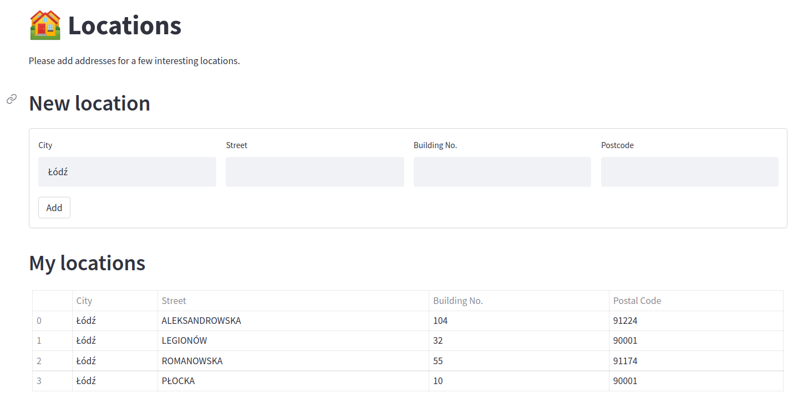
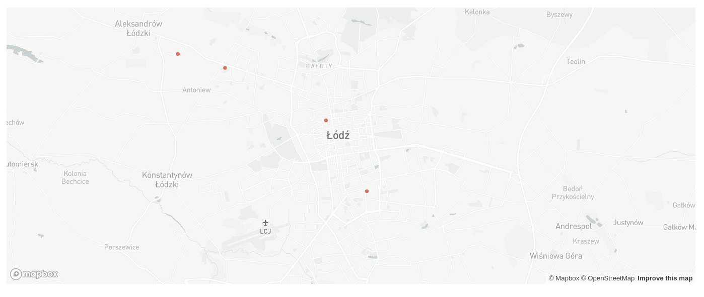
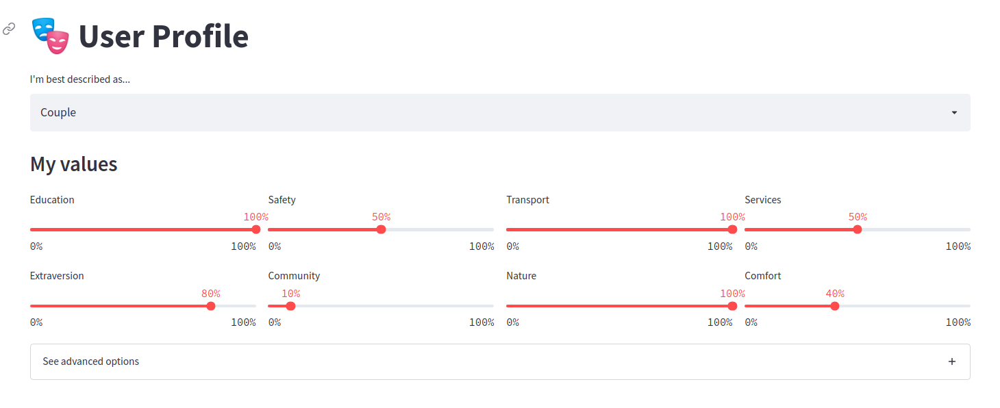
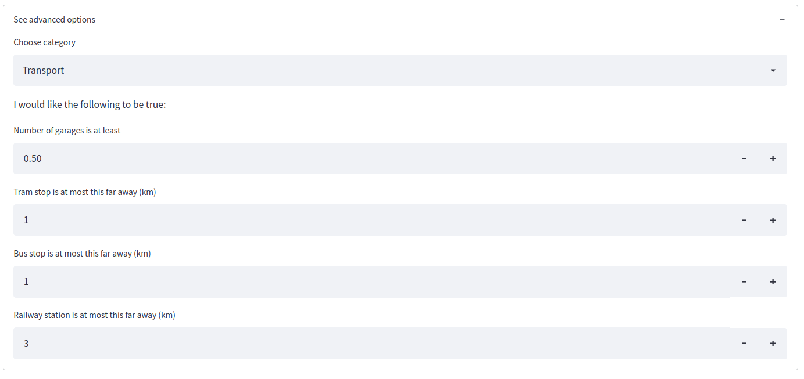
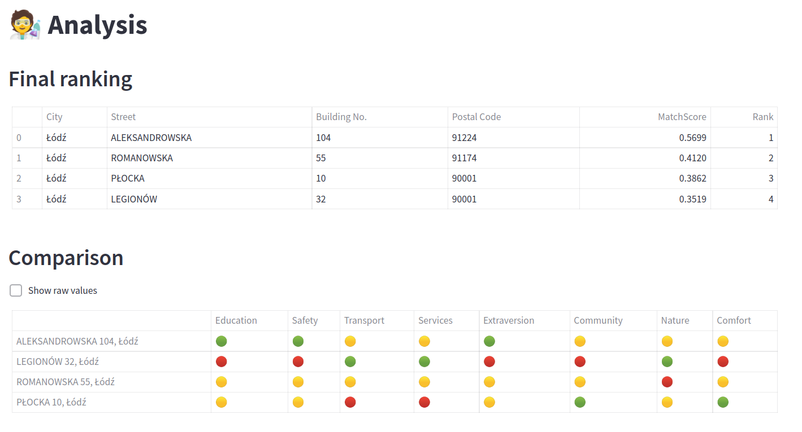
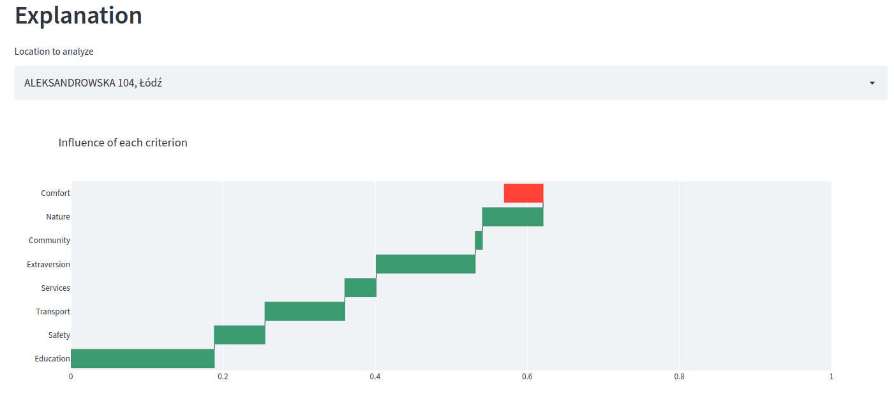

# hackyeah2021

## How to use

To use HomeAware addresses of the houses interesting for the user should be loaded. To do that, enter addresses in the text fields accordingly and press “Add”. Here we’ve already added four locations.



The map shows where each address is located on the map of Łódź.



Then, User Profile should be set by choosing the user category and changing values of each criterion to match the user’s needs. 



If the user wants to use advanced options, they should press that option and  a list of other possibilities will unfold.

Users can choose for which category they can access its precise criterion, hidden by default. 



Finally, the app shows the final ranking of houses provided and shows the comparison of different criteria among them.

Additionally, an explanation for each address is provided, presenting the result on each category.



Additionally, an explanation for each address is provided, presenting the result on each category.




## How to run

Install requirements.

```
pip install -r requirements.txt
```

Run app by executing the following command in the same directory as `README.md`.

```
streamlit run src/app.py
```

Run individual scripts as:

```
python -m src.res
```

## Certificates
Certificate:
```
openssl pkcs12 -in srodmiescie4.pfx -clcerts -nokeys -out src/srodmiescie4.crt
```

Key:
```
openssl pkcs12 -in srodmiescie4.pfx -nocerts -nodes -out srodmiescie4.key
```
